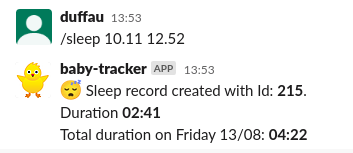

# 🐥 Slack Baby Tracker

A web server listening for [Slack Slash Commands](https://api.slack.com/interactivity/slash-commands) to track sleep, poop, food and weight of newborns.

## Usage

When the web app [is deployed](#deployment) and the [Slack app is set up](#slack-setup) you interact with the `Baby Tracker` by typing commands in a specific slack channel.

For example you can register a sleep session ...



or analyze the the weight growth of your baby.


## Usage specifics

Each variable has a dedicated Slack Slash command:

```
/sleep
/food
/poop
/weight
```

and the shorthand counterparts:

```
/sl
/f
/po
/w
```

For each of the top level commands `/sleep`, `/poop`, `/food` and `/weight` there are four actions available:

- `help`
- `create`
- `delete`
- `list`
- `analyze`

To interact with the `/sleep` records the actions are invoked like so:

**Get a help text for the sleep command**
```
/sleep help
```

**Create a sleep record lasting from 8:45 to 11:15**:
```
/sleep 08:45 11:15
```
**Delete a sleep record with id 71**:
```
/sleep delete 71
```

**List 5 latest sleep records**:
```
/sleep list 5
```

**Analyze sleep records**:
```
/sleep analyze
```

## Slack setup

First [create an Slack app](https://api.slack.com/apps) in a workspace you control.

Give the *Bot Token Scope* the following permissions:
- `commands`
- `files:write`

Copy the *Bot User OAuth Token*.

Add *Slash Commands* for each command and (optionally) a shorthand version as well:


The *Requests URL* for the top level command should be:
```
http://<ip or domain of server>/babytracker/<command>
```
So, if your server has ip `93.184.216.34`, the `/sleep` (and `/sl`) command should have *Requests URL*:

```
http://93.184.216.34/babytracker/sleep
```
⚠ Notice that all communication is over plain HTTP, not HTTPS, so everything is passed in plain text between the Slack client and your server.


## Deployment